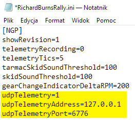
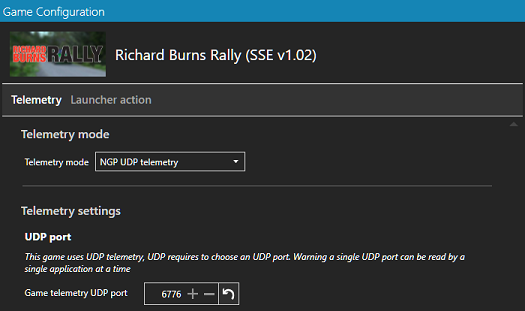
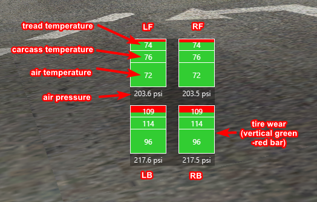
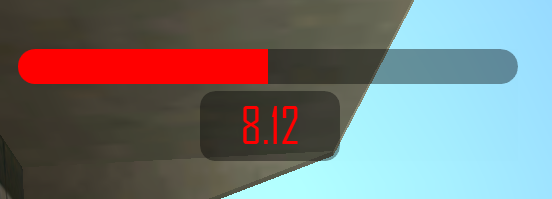

# RBR Simhub overlays
My set of Simhub overlays for Richard Burns Rally

**Overlay installation:**

just double click downloaded *.simhubdash* file to import it into Simhub

**Prerequisites:**

Richard Burns Rally with enabled UDP telemetry output (see *richardburnsrally.ini* file), RBR's Simhub profile switched to UDP telemetry.

## Tire view
*last version: 27.02.2021*

Overlay that shows tire temperatures, pressure, and wear.

## Delta
*last version: 30.08.2021*

Overlay that shows delta to best time

